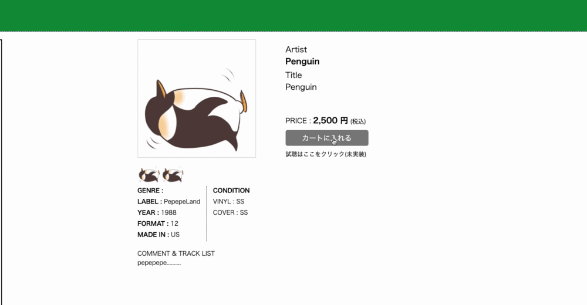
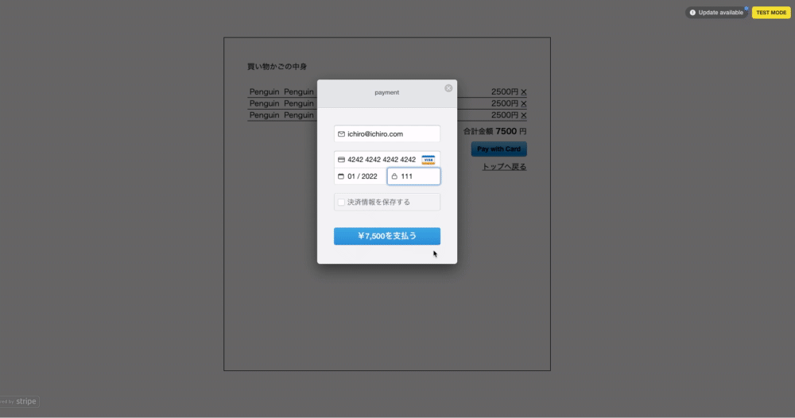
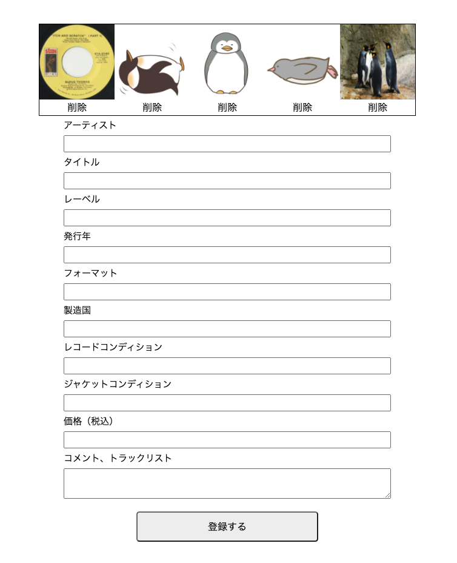

# アプリ名

## Fukinoto Records

# 概要
レコード店のECサイトです。
普段自分自身が使っているECサイトはどのようにして作られているのか疑問に思っていました。  
また、レコード店を営む知り合いの方が運営しているECサイトで、不満に思っている部分を将来的に解消していきたいと思い、作成に至りました。  

# 目標

・商品を個別に出品できるようにする。  
・商品画像を複数枚投稿を可能にする。  

# 使い方

### 購入者用アカウント
メールアドレス: ichiro@user.com  
パスワード: ichiro16  

### 管理者用
メールアドレス名: ichiro@admin.com  
パスワード: ichiro16  
### 購入者用機能

#### ※管理者用アカウントでログインしておりますと、購入者機能が使用できなくなるため、購入者用機能をお試しになる場合は、一旦ログアウトしてから購入者用アカウントでログイン後、お試しください。

#### ・カート機能

購入者アカウントでログイン後、商品詳細ページにて"カートに入れる"をクリックしていただけますと、商品がカートに追加されます。また値段横の×をクリックしますと、カートから商品が削除されます。

#### ・商品購入機能

商品をカートに追加後、カートページに飛びますので、Pay With Cardのアイコンをクリックしていただくと、カード情報の入力欄がでますので、以下の情報を入力していただけますと購入機能をお試しいただけます。

#### 購入用カード情報  
メールアドレス: ichiro@ichiro.com  
番号： 424242424242  
期限： 01 / 2022  
セキュリティコード：111  

### 管理者用機能

#### ・商品出品機能

商品の出品ができます。  
商品画像を5枚まで追加できます。

#### ・商品編集機能(実装途中)

出品した商品の編集ができます。  
実装中です。  

# 構築やインストール方法

ターミナルまたはコマンドプロンプトにて以下のコマンドを順番に実行してください。

`git clone https://github.com/taketoshi1214/fukinoto_records.git`

`cd fukinoto_records`

`bundle install`

`rails db:create`

`rails db:migrate`

`rails db:seed`

`rails s`

上記のコマンドを実行後、以下のURLでアクセス可能です。

http://localhost:3000

# 今後実装、または改善していきたいこと

# データベース設計